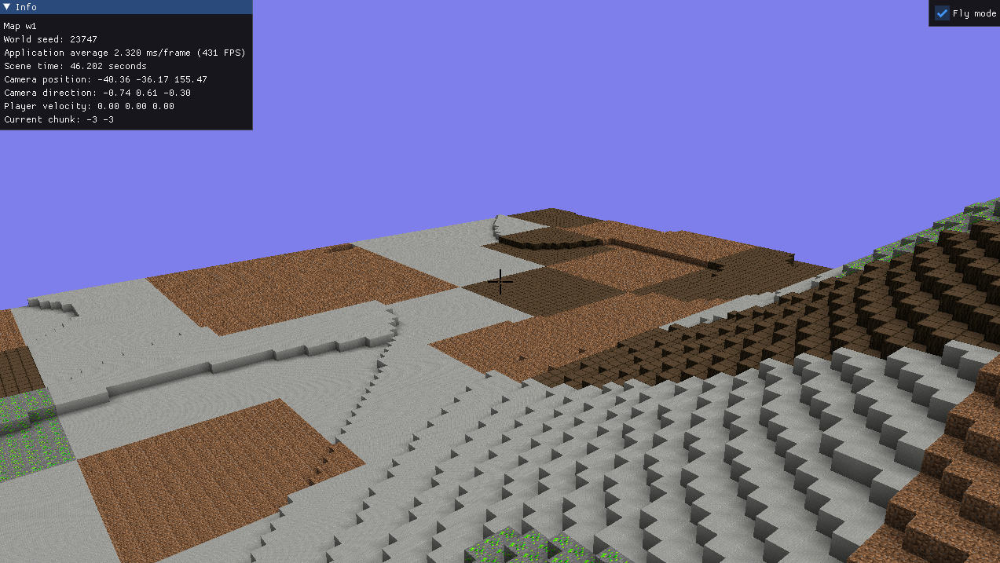
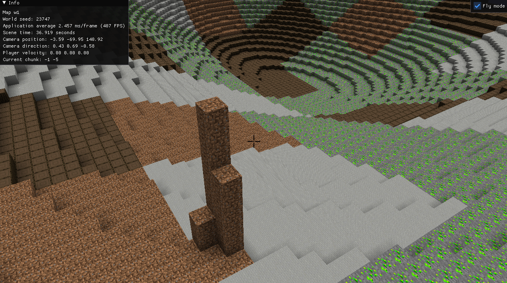
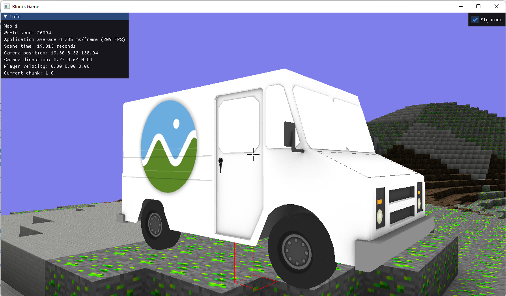

# Blocks
Minecraft-like game made from scratch.

## Features

- Endless procedural generated voxel world
- Placing and removal blocks
- Simple physics
- Separate wpf tool for managing assets

## How to build

Project is built using CMake. Compiler must support c++ 20. Only tested on Windows.

## Screenshots

